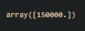

# Implementation of Decision Tree Regressor Model for Predicting the Salary of the Employee
## AIM:
To write a program to implement the Decision Tree Regressor Model for Predicting the Salary of the Employee.
## Equipments Required:
1. Hardware – PCs
2. Anaconda – Python 3.7 Installation / Moodle-Code Runner
## Algorithm
1. Import pandas to read the csv files.
2. Display the head and tail of the dataset.
3. Import LabelEncoder() from sklearn.preprocessing.
4. Label the data which are not in the integer type.
5. Assign the X and Y from the dataset.
6. Split the dataset using train_test_split from sklearn.model_selection.
7. nImport DecisionTreeRegressor from sklearn.tree
8. Fit the Training set in a variable.
9. Import metrics from sklearn to find the Mean Squared Error.
10. Predict the result for the given values.
## Program:
```
Developed by: Sai Darshan G
RegisterNumber:  212221240047
import pandas as pd
data=pd.read_csv("Salary.csv")
data.isnull().sum()
from sklearn.preprocessing import LabelEncoder
le=LabelEncoder()
data["Position"]=le.fit_transform(data["Position"])
x=data[["Position","Level"]]
y=data["Salary"]
from sklearn.model_selection import train_test_split
X_train,X_test,Y_train,Y_test=train_test_split(x,y,test_size=0.2,random_state=2)
from sklearn.tree import DecisionTreeRegressor
dt=DecisionTreeRegressor()
dt.fit(X_train,Y_train)
y_pred=dt.predict(X_test)
from sklearn import metrics
mse=metrics.mean_squared_error(Y_test,y_pred) 
r2=metrics.r2_score(Y_test,y_pred)
dt.predict([[5,6]])
```
## Output:

## Result:
Thus the program to implement the Decision Tree Regressor Model for Predicting the Salary of the Employee is written and verified using python programming.
